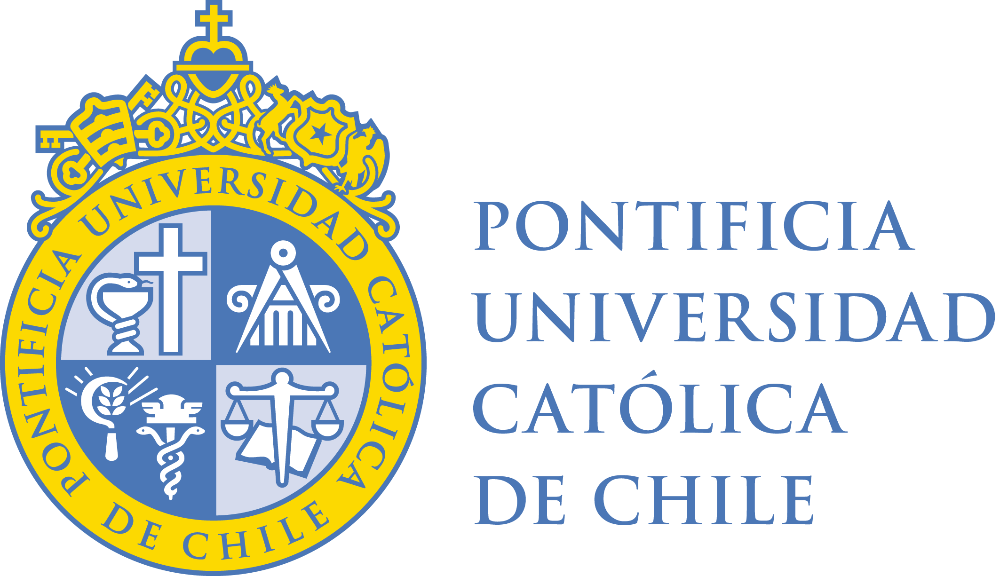

## Workshop on Scientific Machine Learning

###  Sobre el Evento
Este workshop de un día está diseñado para estudiantes interesados en investigación en el área de **Scientific Machine Learning (SciML)**. Contaremos con la participación de destacados investigadores y colaboradores de la línea de investigación **RL4 Aprendizaje Basado en la Física** del **Centro Nacional de Inteligencia Artificial (CENIA)**, quienes presentarán avances recientes. Ademas, dictaremos un minicurso titulado: Sensado de campos espacio temporales a partir de sensores escasos y puntuales: un tutorial.

## 🗓️ Detalles Clave
* **Fecha:** Viernes, 28 de agosto de 2026
* **Horario:** 09:00 - 17:00 hrs
* **Lugar:** Auditorio Ninoslav Bralić, Campus San Joaquín, Pontificia Universidad Católica de Chile (UC)

## 📝 Inscripción
Los cupos son limitados. Asegura tu lugar completando el formulario:
[**👉 Formulario de Inscripción**](https://forms.cloud.microsoft/r/v699TKSPW0) 

---

## 🕒 Cronograma de Actividades

| Hora | Actividad | Detalle |
| :--- | :--- | :--- |
| **09:00 - 09:15** | Palabras de Apertura | Bienvenida e introducción de la linea RL4 de Cenia. |
| **09:15 - 10:00** | **Charla Keynote: Felipe Galarce (PUCV, CID3B)**  | Asimilaciòn de datos y reducciòn de modelos aplicada a flujos sanguineos |
| **10:00 - 10:30** | **Charla 1: Carlos Sing-Long** (Inv. RL4 CENIA, UC) | Solving ill-posed inverse problems with inVAErt networks |
| **10:30 - 11:00** | *Coffee Break*  | Espacio para interactuar con expositores |
| **11:00 - 11:30** | **Charla 2: Francisco Sahli** (Inv. RL4 CENIA, UC) | Physics-informed neural networks for cardiovascular digital twins |
| **11:30 - 12:00** | **Charla 3: Federico Fuentes** (Inv. RL4 CENIA, UC) | An r-adaptive finite element method using neural networks for parametric self-adjoint elliptic problems |
| **12:00 - 12:30** | **Charla Oportunidades de Investigación RL4**  |  |
| **12:30 - 13:30** | *Almuerzo* | - |
| **13:30 - 15:00** | **Minicurso: Prof. Benjamín Herrmann, Camila Olavarría y Gabriel Aguayo**  | Sensado de campos espacio temporales a partir de sensores escasos y puntuales: un tutorial|
| **15:00 - 13:00** | *Coffee Break* | Espacio para interactuar con expositores |
| **15:30 - 16:00** | **Charla 4: Pedro Saa** (Inv. RL4 CENIA, UC) | Aprendizaje informado por modelos físicos aplicado a la simulación de bioprocesos |
| **16:00 - 16:30** | **Charla 5: Juan Jose Molina** (Inv. CENIA) |  Operator-informed initialization for Fourier features physics-informed neural networks |
| **16:30 - 17:00** | **Charla Estudiantes** | **Gabriel Miranda**, **Tabita Cabalán**, **Ignacio Tapia** |
| **17:00 - 17:15** | **Cierre y Conclusiones** | Próximos pasos y cierre del evento. |

---

## Charla Keynote, abstract
Las enfermedades cardiovasculares suponen una de las primeras causas de muerte a nivel mundial. El estudio de flujos sanguineos a traves de estrategias propias de la mecánica computacional y aprendizaje de máquinas dan lugar a herramientas de diagnóstico, seguimiento y tratamiento de patol´ogias que involucran alteraciones en la dinámica normal de la sangre. Este trabajo relata una serie de contribuciones alrededor de esta idea, en donde se integran modelos de alta fidelidad con im´agenes m´edicas que otorgan acceso parcial a la velocidad de la sangre en distantas regiones del sistema cardiovascular. Buscamos entonces la construccion de métodos robustos que sean capaces de predecir cantidades de interés para la comunidad biomédica, utilizando técnicas de reducción de modelos, redes neuronales y métodos variacionales.

## 💻 Preparación para el Minicurso
Para la sesión de la tarde se requiere traer computador personal. Trabajaremos en **Jupyter Notebooks/Colab**. Los materiales estan disponible en el siguiente link

[**👉 Tutorial**](https://colab.research.google.com/drive/1V_95xC4KmYW45Yt6aYU5Slh74kEuhp72?usp=sharing)

---
**Comité Organizador:**
* Paula Aguirre, Federico Fuentes, Benjamín Herrmann, Pedro Saa, Francisco Sahli, Manuel A. Sánchez, Carlos Sing-Long

**Eventos anteriores**
https://sites.google.com/ing.puc.cl/wosciml2022/home

  
  

 
